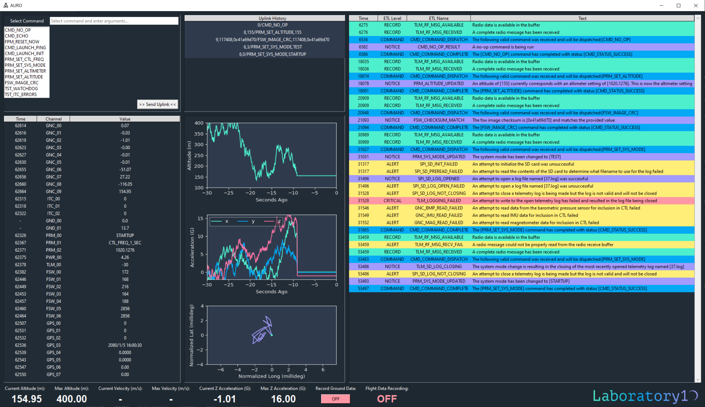

    
       
    <h1 align='bottom'>&nbsp;&nbsp;AURO: Flight Software</h1>

## Section 1: Project Overview

Welcome to AURO! ***This repository is a public README for the private AURO repository which contains the full source code. If you would like full access to the AURO source code email laboratory0010@gmail.com.*** The <a href="https://github.com/laboratory10/auro">AURO</a> repository houses the Flight Software source code for an avionics platform that has a small form factor and can fit into an amateur rocket kit. While the focus of this project is the Flight Software for the avionics, you will also find source code for ground support equipment, design documentation, and log files from flights.

Before going further, I would like to cover my motivation for this project so many of the architecture decisions make more sense. I am interested in developing a system that allows me to challenge and showcase my capabilities as a Flight Software Engineer. While the term Embedded Software Engineer is used more broadly across different industries, I am using the term `Flight Software` (FSW) throughout to signal that the expectation for autonomy and fault tolerance of this code should be on par with design principles used in spaceflight applications.

### Section 1.1: Mission System Architecture
This project is made up of four distinct systems. When referred to all together, the term `Mission System` is used. At an individual system level, there is `AURO` or the `Flight System`, the `Launch Station`, the `Base Station`, and the `Ground System`. Sometimes, the final three are jointly referred to as the `Ground Segment`.
1. AURO (/auro/auro_flight/)
    - The flight vehicle and where much of the development effort is focused. The 3D printed Avionics Bay that accompanies AURO can fit into 76mm diameter rocket kits.
    - The hardware consists of:
        - 3.7v 500mAh Lithium Ion Polymer Battery
        - Flight Computer: ATSAMD21G18 ARM Cortex M0 processor
        - Micro SD storage flight logger
        - 915 MHz radio
        - Accelerometer
        - Magnetometer
        - Gyroscope
        - Altimeter
        - GPS receiver
    - Developed in C with some C++ to interface with board/sensor drivers
    - Uses the <a href="https://www.freertos.org/index.html">FreeRTOS</a> kernel to implement the Real-Time Operating System
      ***The integrated AURO system***
     &nbsp;&nbsp; 
     
2. The Base Station (/auro/base_station/)
    - A device that receives flight data from AURO and passes it along a serial interface to the ground system
    - The hardware consists of:
        - ATSAMD21G18 ARM Cortex M0 processor
        - 915 MHz radio
    - Developed in C++
      ***The integrated Base Station***
      
     
3. The Ground System (/auro/ground_system/)
    - The telemetry visualization application that receives data from the Base Station over serial and displays it
    - Developed in python
      ***Ground System screenshot***
      
     
   
4. The Launch Station (/auro/launch_station/)
    - A device that energizes the launch circuit when commanded to ignite the rocket motor
    - Hardware consists of:
        - 3.7v 500mAh Lithium Ion Polymer Battery
        - Flight Computer: ATSAMD21G18 ARM Cortex M0 processor
        - 915 MHz radio
        - Power and safety switches
        - Igniter cables
        - 9V battery
    - Developed in C++
      ***The integrated Launch Station***
      
     

## Section 2: Flight Software Architecture

### Section 2.1: Choosing C, FreeRTOS, and the Arduino Compiler
In this section, we delve into the architecture of the most important portion of the Mission System: AURO's Flight Software (FSW). We will discuss the technologies, design decisions, and testing methodologies employed.

The FreeRTOS (Real-Time Operating System) kernel serves as the foundation for AURO's multitasking capabilities, enabling efficient task scheduling and resource management. FreeRTOS was chosen because it is open-source, representative of more complex RTOS frameworks in use for spacecraft development, and has several ports available for processor architectures that are common on boards that fit the rocket form factor.

The boards and sensors used for the avionics are commercially available and have board support packages and drivers tightly partnered with the Arduino IDE. For this reason, the Arduino IDE was used throughout development to manage board support packages, drivers, libraries, and compilation. While this made development easier, I was not interested in making a massive 'sketch' or sets of 'sketches' (sketch is an Arduino term and refers to a C++ adaptation in use with .ino files) that make use of many of the guardrails of the Arduino environment. I was interested in being confronted with realistic architectural and design challenges that a FSW team working on robotic spacecraft would be faced with and using too much of the C++ and Arduino utilities gave me less architectural control and challenge. For these reasons, while the Arduino IDE is used to compile the project and a small amount of C++ is used to interface with drivers, the only .ino/C++ file is simply in place as an entry point to the greater FSW environment which is entirely written in C.

### Section 2.2: AURO's FSW Architecture
#### Section 2.2.1: Arduino and the Impact on Directory Structure
The AURO repository contains a directory for each of the 4 systems in the overall Mission System as well as other directories for Mission/Project level files. The AURO FSW lives in `auro/auro_flight/` and will be the focus of this section.

Inside `auro/auro_flight/` are one file and two subdirectories. The file `auro/auro_flight/auro_flight.ino` is a special file required for the Arduino IDE to properly compile the FSW image. As discussed in Section 2.1, the Arduino IDE ***requires*** that all source code is either in or called from an `.ino` file or is in a directory named `src`. No other files will be included for compilation. In addition, the `setup()` and `loop()` functions called by the main Arduino entry point must be present in a file ***with the same name*** as the project name (i.e. the project directory auro_flight must have a `auro_flight.ino` with a setup and loop function). In addition to this special file, the `auro/auro_flight/` directory also contains the `/auro/auro_flight/build/` directory which is home to the FSW image binaries generated by the Arduino IDE on compilation. Finally, the `auro/auro_flight/src/` directory contains all the FSW source code.

#### Section 2.2.2: Board Support Packages, Device Drivers, Libraries, and Includes
In order for everything to work properly, the following board support packages and libraries must be installed via the Arduino IDE:

- Board Support Package:
    - <a href="https://learn.adafruit.com/adafruit-feather-m0-radio-with-lora-radio-module/using-with-arduino-ide">Arduino SAMD Boards</a> by Arduino
    - <a href="https://learn.adafruit.com/adafruit-feather-m0-radio-with-lora-radio-module/using-with-arduino-ide">Adafruit SAMD Boards</a> by Adafruit
- Real Time Operating System:
    - <a href="https://github.com/BriscoeTech/Arduino-FreeRTOS-SAMD21">Arduino-FreeRTOS-SAMD21</a> by BriscoeTech (a port of Richard Barry's FreeRTOS)
- Radio:
    - <a href="https://github.com/adafruit/RadioHead">RadioHead</a> Adafruit Fork
- General Adafruit Sensors:
    - <a href="https://github.com/adafruit/Adafruit_Sensor">Adafruit Unified Sensor</a> by Adafruit
    - <a href="https://github.com/adafruit/Adafruit_BusIO">Adafruit BusIO</a> by Adafruit
- IMU/Gyro and Magnetometer:
    - <a href="https://github.com/adafruit/Adafruit_LIS3MDL">Adafruit_LIS3MDL</a> by Adafruit
    - <a href="https://github.com/adafruit/Adafruit_LSM6DS">Adafruit_LSM6DS</a> by Adafruit
- Barometric Pressure Sensor:
    - <a href="https://github.com/adafruit/Adafruit_BMP3XX">Adafruit_BMP3XX</a> by Adafruit
- GPS Sensor:
    - <a href="https://github.com/adafruit/Adafruit_GPS">Adafruit_GPS</a> by Adafruit

Throughout AURO's FSW, you will find the following external header files included:
 
    Header files from the standard Arduino library or packages mentioned above:
        <Adafruit_BMP3XX.h> - (requires cpp)
        <Adafruit_GPS.h> - (requires cpp)
        <Adafruit_LIS3MDL.h> - IMU/gyro (requires cpp)
        <Adafruit_LSM6DSOX.h> - magnetometer (requires cpp)
        <Adafruit_Sensor.h>
        <Arduino.h> - standard arduino library (writing to pins, serial, etc.)
        <delay.h> - (millis(), delay())
        <FreeRTOS_SAMD21.h> - real time operating system
        <RH_RF69.h> - radio library (requires cpp)
        <SD.h> - secure digital (SD) card library (requires cpp)
        <SPI.h> - serial peripheral interface library (radio and sd card)
        <Wire.h> - i2c device library (bmp, gps, imu/gyro, mag)

    Standard C Library Headers
        <errno.h>
        <stdbool>
        <stdint.h> - (uint8_t, etc)
        <stdio.h> - (snprintf, etc)
        <stdlib.h> - (strtol, NULL, size_t, rand, etc)
        <string.h> - (strnlen, etc)
        <time.h> - (time conversion of gps data, rand seeding)

#### Section 2.2.3: FSW Modules and Tasks
Inside of `auro/auro_flight/src`, the AURO FSW is structured into several modules. The term `module` will be used to refer to the sub-directories present within the src directory. Of the modules present, some have a special significance in that they may host their own `FSW Task`. A FSW Task is a thread of execution that is designed to serve a specific functionality. Many tasks are running concurrently and competing for processor capacity. It is the job of the RTOS scheduler to determine which task has the priority and will be given the processor. More information about a FreeRTOS task (which is one in the same as an AURO FSW Task) can be found in the <a href="https://www.freertos.org/about-RTOS.html">FreeRTOS Documentation</a>. The modules that have a task running are denoted with the '_' character at the start of their directory name. This visually separates them from modules without a FSW Task and pulls them to the top in most filesystem explorers.

Within each FSW module, there can be various FSW source code files that makeup the functionality of that module. Files ending in `_task.c/h` contain the source code for FSW tasks and functions called by the task itself. Files ending in `_utils.c/h` contain utilities used across multiple files in a module but not used outside the module. Files ending in `_commands.c/h` contain handler functions associated with FSW commands. These are commands that can be issued by the operator on the ground and are received, parsed, and executed by AURO. Files ending in `_client.c/h` contain functions that are designed for use both internally and externally of the given module. For example, the Fault Protection Manager or `_fpm` module includes the file `fpm_client.c` which contains the function definition for `fpm_assert`. This function can be called by any module and any task to alert the `FPM` module that a serious issue has been encountered and a reset should be activated. As was done in the previous sentence, it would be correct to refer to the Fault Protection Manager Module as `fpm`, `FPM`, `_fpm`, or any other reasonable deviation.

At the time this documentation was generated, AURO consists of the following FSW Modules:
 - **_FPM** - Fault Protection Manager - The highest priority FSW Task that detects and responds to anomalies
 - **_TLM** - Telemetry Manager - FSW Task responsible for sending and receiving radio and UART messages
 - **_GNC** - Guidance Navigation and Control Manager - FSW Task responsible for reporting GNC data
 - **_CMD** - Command Manager - FSW Task responsible for validating and executing FSW (ground) commands
 - **_CTL** - Channelized Telemetry Manager - FSW Task responsible for reporting non-GNC channelized telemetry
 - **ETL** - Event Telemetry Module - Client code used to report Event Telemetry
 - **FSW** - Flight Software Module - Command and client code related to FSW topics
 - **ITC** - Inter-Task Communication Module - Client code for sending and processing messages between FSW Tasks
 - **PRM** - Parameter Module - Command and client code for updating and retrieving parameter values
 - **TST** - Test Module - Command and utility code for issuing FSW commands only meant to be executed in `TEST` mode
 - **UTILS** - Utility Module - Client code for utilities ok for use throughout all modules
 - **WAKE** - Wake Module - Boot code for AURO

#### Section 2.2.4: Interfacing with C++ Device Drivers
While C was chosen for the primary language of the source code, some C++ files can be found for special cases that wrap C++ library code in a C interface for use by the rest of AURO. For example, the TLM module includes `tlm_spi.cpp` which wraps functions from the SD and Radio libraries in a C interface. The GNC module has a similar situation with the file `gnc_i2c.cpp`. What is also noteworthy about these two cases is that each of these tasks is the only task allowed to communicate on the specified communications bus. The GNC task is the only one allowed to use the I2C (Inter-Integrated Circuit) bus which connects the flight computer to the Accelerometer, Magnetometer, Gyroscope, Altimeter, and GPS receiver. The TLM task is the only one allowed to use the SPI (serial Peripheral Interface) which connects the flight computer to the Radio and Micro SD storage.

Also in the `/auro/auro_flight/src` directory with the various FSW modules are key files in use throughout all the modules. The `define.h` file contains values established with the define macro that are used throughout AURO. The `enums.h` file contains enumerated values and relevant dictionary info used for ground processing. This file has special formatting rules in place as it is used by the Ground System as a telemetry dictionary. A pair of symlinks to this file also allows the Arduino IDE to properly complie Base Station and Launch Station code by referencing the same enumerated values. The `globals.h` file contains extern declarations to global variables used throughout AURO. The variables themselves are declared and defined in the wake module. The `structs.h` file contains struct definitions used throughout AURO.

#### Section 2.2.5: Telemetry Types
A key set of concepts that is important to understand for this project is how telemetry is organized. In fitting with the objectives of this project, data reported from AURO will look similar to how spacecraft telemetry is structured in industry. Messages sent from AURO to the ground can be one of two types: Event Telemetry (abbreviated to ETL) and Channelized Telemetry (abbreviated to CTL). ETLs can be thought of as a comprehensive system log. In the log, there are a number of entries with a timestamp that note the occurrence of a significant event. This is very similar to the Windows Event Viewer data, to give a parallel to non-spacecraft computing. Also like the Event Viewer, ETLs are each associated with a particular level to describe the type or criticality of the information they contain. At writing, possible ETL levels are RECORD, NOTICE, COMMAND, ALERT, CRITICAL, and LAUNCH. The `enums.h` file has more information about what each level means. In contrast to events, CTLs report specific values of interest at regular intervals that might change over time. An example would be a temperature sensor value. We want to be updated on what the latest readings look like and how it changes over time, but this information isn't necessarily associated with an event.

#### Section 2.2.6: Coding Conventions and Standards
After careful study, one will see several patterns emerge while reviewing the AURO source code. Some of the conventions have already been discussed, such as adding the '_' character to the start of a module name to indicate that it contains a FSW task. There are many more conventions to find that make the code easier to understand and extend. Some examples include:
- Variables that start with the prefix 'PROTECTED_' can only safely be changed inside a FreeRTOS critical section. This prevents a task from being interrupted while the update of a global variable has started but not completed. Reading outside of a critical section is allowed.
- Functions that are called by the CMD module when a FSW command is dispatched are called 'command handlers' and starts with the prefix 'command_'.
- There are strict formatting rules in place for the `enums.h` file to allow it to be used by the Ground System as a telemetry dictionary. This includes rules like requiring ETL text to be formatted with brackets where arguments are to be included and requiring enumeration type names to end with '_ENUM'.

While those AURO-specific conventions are more aesthetic in nature, external standards are also in effect to make the code more reliable and fault tolerant. In 2009, NASA's Jet Propulsion Laboratory published the <a href=https://web.archive.org/web/20111015064908/http://lars-lab.jpl.nasa.gov/JPL_Coding_Standard_C.pdf>JPL Institutional Coding Standard for the C Programming Language</a>. As this standard aligns nicely with the objectives for this project, it was consulted extensively to improve AURO's FSW.

### Section 2.3: Testing
An important thing to understand at this point is the approach taken for testing the system and its FSW. Since the components are inexpensive and easily available, setting up various test frameworks (unit test, software-in-the-loop, hardware-in-the-loop) was deemed less desirable than developing a test framework that uses the end-to-end Mission System. For this reason, full-coverage regression testing can be completed simply by running the `/auro/test/end_to_end_test.py` script. It is expected that each new feature has validation tests added to the test cases in this file and that all tests pass before commits to the codebase are made.

While testing only on the complete system has its advantages, it can also make it more difficult to induce low-probability edge cases that need to be accounted for in the software. For example, what if, for some inexplicable reason, the write to the radio buffer returns a failure? What if an attempt to read from the accelerometer is unsuccessful? For these reasons, the system includes a `TEST` mode that can be activated to artificially invoke these edge cases.

Below is a screenshot showing sample output from `/auro/test/end_to_end_test.py`. It looks like I have some issues to sort out before my next commit.
  ***Sample end-to-end test output***
  
 

## Section 3: The Ground Segment
The Ground Segment comprises the Base Station, Launch Station, and Ground System.

### Section 3.1: Embedded Base Station and Launch Station Code
Code for the Base Station can be found in `/auro/base_station/`. It is designed to be lightweight and simple since the task it performs is simple. The Base Station:
- receives any data transmitted on the radio for relay back to the host computer so it can be displayed with the Ground System
- sends FSW commands from the operator to AURO

Code for the Launch Station can be found in `/auro/launch_station`. Its purpose is also simple, so the code is also lightweight. The launch station:
- listens on the radio link for one of the few FSW commands from the Base Station that requires it to act
- takes the commanded action (namely energize a non-latching relay to complete the launch circuit and ignite the rocket motor)
- report with LAUNCH level ETLs the launch station's actions

For both the Base Station and Launch Station, transmission on the radio link is only allowed if AURO cedes transmission rights by initiating a Groundspeak session. AURO does this by transmitting a special packet to indicate some other system may transmit for a short time. The Ground System implements logic that deconflicts usage of the Groundspeak session between the Base Station and Launch Station by disabling user transmission of FSW commands for a short time.

### Section 3.2: Ground System (Telemetry Visualization)
The Ground System consists of the python tkinter application that visualizes the AURO data that is being received. The main components of the interface are:
- FSW Command Builder allow the user to build and send commands
- Uplink History Frame to allow the user to review previously sent commands and select them for re-transmission
- CTL Frame to display the latest CTL values by channel
- CTL Plot Frame to display channel plots for certain channels
- ETL Frame to display the ETL log

The Ground System is not designed to be the focus point of this project since it is not FSW code. While the Ground System should look nice and work well, it is not a good example of how to build a state-of-the-art telemetry visualization / command and control application.

It is also important to note that the Ground System needs to be told what serial port to look for data on. It will gracefully handle both data coming from the Base Station or data coming directly from AURO if you have the AURO flight computer plugged in via USB (though note no serial data is transmitted by AURO in FLIGHT mode).

The ground station can be launched with a command similar to `python /auro/ground_system/ground_system.py`:
  ***Ground System screenshot***
  
 

### Section 3.3: Telemetry Logging
The Ground System has a button along the bottom of the window that toggles ground data recording. If activated, each message that comes off the serial bus (after it is byte-decoded) is written to the log file and stored in `/auro/recorded_ground_data/`. Each time a log file is opened, the entire contents of `enums.h` are added at the start of the log file to allow it to be parsed by the Ground System far into the future even when the telemetry dictionary (`enums.h`) changes. A playback of a telemetry file can be accomplished by running a command such as `python /auro/ground_system/ground_system.py sample_filepath.log`.

Flight logs are generated onboard AURO when it is in flight mode. While the process to play the log files is identical, archiving it is more manual. The flight logs need to be manually pulled off the SD card and put in the `/auro/recorded_flight_data` directory. For playback to work correctly, the contents of the `enums.h` ***that was in use when the log was generated*** must be inserted into the start of the log file and saved by the operator.
  ***The Ground System in log playback mode***
  
 

### Section 3.4: Ground Segment Testing
Section 2.3 covers many AURO-cetric testing concepts, some of which have implications for Ground Segment testing. First, because of the design of the end-to-end test framework, the Base Station and Launch Station are tested as a group at that time. The Ground System, however, does not have its own automated testing. Changes to the codebase require the developer to manually verify the desired Ground System functionality by launching the telemetry viewer with the `ground_system.py` file. To make this process somewhat easier, some of the TST commands and the TEST system mode are designed to make Ground System issues easier to spot. For example, some GNC channels in TEST mode report values that change by a random amount for each channel report. Even though the altitude may not really be changing wildly, having more dynamic data on the plots can significantly aid the tester.

## Section 4: Hardware Integration
### Section 4.1: Purchased Parts List
- AURO
    - <a href="https://www.adafruit.com/product/2796">Adafruit Feather M0 Adalogger</a>
    - <a href="https://www.adafruit.com/product/3229">Adafruit Radio FeatherWing - RFM69HCW 900MHz - RadioFruit</a> (includes male headers)
    - <a href="https://www.adafruit.com/product/1578">Lithium Ion Polymer Battery - 3.7v 500mAh </a>
    - <a href="https://www.adafruit.com/product/4816">Adafruit BMP390 - Precision Barometric Pressure and Altimeter - STEMMA QT / Qwiic</a>
    = <a href="https://www.adafruit.com/product/4565">Adafruit LSM6DSOX + LIS3MDL FeatherWing - Precision 9-DoF IMU</a>
    - <a href="https://www.adafruit.com/product/4415">Adafruit Mini GPS PA1010D - UART and I2C - STEMMA QT</a>
    - <a href="https://www.adafruit.com/product/4399">STEMMA QT / Qwiic JST SH 4-Pin Cable - 50mm Long</a> (2x)
    - <a href="https://www.adafruit.com/product/1661">uFL SMT Antenna Connector</a>
    - <a href="https://www.adafruit.com/product/2830">Stacking Headers for Feather - 12-pin and 16-pin female headers</a>
    - <a href="https://www.adafruit.com/product/2886">Header Kit for Feather - 12-pin and 16-pin Female Header Set</a>
    - <a href="https://www.adafruit.com/product/4269">Simple Spring Antenna - 915MHz</a>
    - <a href="https://www.amazon.com/gp/product/B010Q57SEE/ref=ppx_yo_dt_b_asin_title_o07_s00?ie=UTF8&psc=1">SanDisk Ultra 16GB Ultra Micro SDHC</a>
    - Low voltage wiring for jumpers
- BASE STATION
    - <a href="https://www.adafruit.com/product/3176">Adafruit Feather M0 RFM69HCW Packet Radio - 868 or 915 MHz - RadioFruit</a> (includes male headers)
    - <a href="https://www.amazon.com/gp/product/B095JTW6XM/ref=ppx_yo_dt_b_asin_title_o04_s00?ie=UTF8&psc=1">915MHz LoRa Antenna Omni 5dbi Gain SMA Male</a> (one for Base Station and one for Launch Station)
    - <a href="https://www.adafruit.com/product/1661">uFL SMT Antenna Connector</a>
- LAUNCH STATION
    - <a href="https://www.adafruit.com/product/3076">Adafruit Feather 32u4 RFM69HCW Packet Radio - 868 or 915 MHz - RadioFruit</a>
    - <a href="https://www.adafruit.com/product/2895">Adafruit Non-Latching Mini Relay FeatherWing</a> (includes male headers)
    - <a href="https://www.amazon.com/gp/product/B095JTW6XM/ref=ppx_yo_dt_b_asin_title_o04_s00?ie=UTF8&psc=1">915MHz LoRa Antenna Omni 5dbi Gain SMA Male</a> (one for Base Station and one for Launch Station)
    - <a href="https://www.adafruit.com/product/1661">uFL SMT Antenna Connector</a>
    - <a href="https://www.adafruit.com/product/2886">Header Kit for Feather - 12-pin and 16-pin Female Header Set</a>
    - <a href="https://www.adafruit.com/product/1578">Lithium Ion Polymer Battery - 3.7v 500mAh </a>
    - <a href="https://www.adafruit.com/product/1131">JST-PH Battery Extension Cable - 500mm</a>
    - <a href="https://www.adafruit.com/product/3218">Illuminated Toggle Switch with Cover - Red</a>
    - <a href="https://www.adafruit.com/product/3307">Illuminated Toggle Switch with Cover - Green</a>
    - 9-volt battery
    - Low voltage wiring for jumpers
    - High voltage wiring for launch circuit
### Section 4.2: 3D Printed Parts and Assembly Hardware
- ASSEMBLY HARDWARE
    - <a href="https://www.amazon.com/gp/product/B08LW54QDW/ref=ppx_yo_dt_b_asin_title_o07_s00?ie=UTF8&psc=1">300Pcs Metric M2.5 Stainless Steel Phillips Pan Head Machine Screws Nuts Assortment Kit- M2.5X</a>
    - <a href="https://www.amazon.com/gp/product/B0BK1CD467/ref=ppx_yo_dt_b_asin_title_o07_s02?ie=UTF8&psc=1">YOKIVE 150 Pcs M2.5 Standoff Screws</a>
    - <a href="https://www.amazon.com/gp/product/B07SPWZT5G/ref=ppx_yo_dt_b_asin_title_o06_s00?ie=UTF8&psc=1">100pcs M2.5 Thread Brass Knurled Threaded Insert Embedment Nuts</a>
- 3D PRINTED PARTS (Avionics and Ground Equipment Boxes)
    - see stl files in `/auro/cad_objects/` for:
        - AURO Parts
            - Battery Enclosure
            - Fixed Avionics Bay
            - Removable Avionics Bay
        - Base Station Parts
            - Base Station Base
            - Base Station Top
        - Launch Station Parts
            - Launch Station Base
            - Launch Station Main Top
            - Launch Station Antenna Top

### Section 4.3: AURO Integration
1. Melt embedment nuts into 6 holes on the Fixed Avionics Bay using soldering iron
2. Melt embedment nuts into 2 holes on the side of the Removable Avionics Bay where the Battery Enclosure screws enter
3. Melt embedment nuts into 4 holes on the side of the Removable Avionics Bay where the board mounts
4. Add screw standoffs to the 4 holes where the board mounts
5. Solder a jumper from pin 12 to the reset pin on Adafruit Feather M0 Adalogger
6. Solder jumper from pin 11/A to pin RST on Adafruit Radio FeatherWing
7. Solder jumper from pin 6/D to pin CS on Adafruit Radio FeatherWing
8. Solder jumper from pin 5/E to pin IRQ on Adafruit Radio FeatherWing
9. Solder the spring antenna into the antenna hole on the Adafruit Feather M0 Adalogger
10. Solder Female Header Set to Adafruit Feather M0 Adalogger with black connector on the top side of the board
11. Solder Stacking Header to Adafruit Radio FeatherWing with black connector on the top side of the board
12. Solder Male Header Set to Adafruit LSM6DSOX + LIS3MDL FeatherWing - Precision 9-DoF IMU with the longer portion of the pins on the bottom side of the board
13. Screw the Adafruit Feather M0 Adalogger into the Removable Avionics Bay
14. Insert the stacking header male pin into the Adafruit Feather M0 Adalogger female pins
15. Insert the IMU male pins into the stacking header female pins
16. Add a standoff to two holes that share a long side of the IMU using a nut from the screw kit
17. Screw the GPS antenna into one of the two standoffs on the IMU
18. Screw the BMP sensor into the other standoff on the IMU
19. Use the two STEMMA QT cables to connect the IMU and GPS and the GPS and BMP
20. Thread the battery cable through the opening, place the battery in the appropriate position, and attach the battery enclosure with screws
21. As desired, finish assembly by plugging in the battery, adding the SD card, and connecting the Removable and Fixed Avionics Bays
  ***The integrated AURO system***
 &nbsp;&nbsp; 
 

### Section 4.4: Base Station Integration
1. Melt embedment nuts into the 8 2.5mm holes on the Base Station base using soldering iron
2. Insert four standoff screws on the bottom surface of the inside of the Base Station base
3. Solder uFL SMT connector to appropriate pad on the Adafruit Feather M0 RFM69HCW
4. Mount the Adafruit Feather M0 RFM69HCW board inside the Base Station using the standoffs and M2.5 screws
5. Mount the LoRa Antenna to the hole in the Base Station top
6. Connect the Lora Antenna cable to the uFL connector that was previously soldered
7. Mount the top of the Base Station to the base using M2.5 screws
  ***The integrated Base Station***
 &nbsp;&nbsp; 
 

### Section 4.5: Launch Station Integration
1. Melt embedment nuts into the 9 2.5mm holes on the Launch Station base using soldering iron
2. Insert four standoff screws on the bottom surface of the inside of the Launch Station base
3. Mount the illuminated toggle switches in the two appropriate holes (the larger two) on the Antenna Top
4. Mount the LoRa Antenna to the remaining hole in the antenna top
5. Solder uFL SMT connector to appropriate pad on the Adafruit Feather 32u4 RFM69HCW
6. Solder the Female Header Set to the Adafruit Feather 32u4 RFM69HCW with the black connector portion facing the top of the board
7. Solder the Male Header Set to the Adafruit Non-Latching Mini Relay FeatherWing so that the longer portion of the pin faces the bottom of the board
8. Connect the Adafruit Feather 32u4 RFM69HCW and Adafruit Non-Latching Mini Relay FeatherWing using the pins soldered
9. Cut and splice the JST-PH Battery Extension Cable - 500mm and the Lithium Ion Polymer Battery so that red wire can be run through the green toggle switch
10. Attach the wiring, battery, green switch, and Adafruit Feather 32u4 RFM69HCW such that the board is only powered when the green toggle is flipped up and lighted
11. Wire the 9V battery, red switch, relay, and launch wiring so that the circuit can only completed if the red toggle is flipped up and lighted
12. Solder the jumper wire from pin 12 to the relay set pin
13. Connect launch circuit leads to the appropriate relay outputs
14. Mount the boards to the Launch Station using the standoffs and M2.5 screws
15. Place the Lithium Ion Polymer Battery and 9V battery in the appropriate compartments
16. Mount the top of the Launch Station to the base using M2.5 screws
  ***The integrated Launch Station***
 &nbsp;&nbsp; 
 

## Section 5: Operations
When everything is integrated, AURO, the Base Station, and the Launch Station can be connected via USB to the development machine to compile and flash the image to the boards using the Arduino IDE. If changes were made to AURO code, the new FSW image must be exported to binaries in the Arduino IDE using the toolbar menu `Sketch->Export Compiled Binary` feature.

Next, the Ground System can be launched with the terminal command `python /auro/ground_system/ground_system.py`. Look at telemetry streaming in from AURO and send FSW commands to prepare it for its journey skyward. Remember, a fully assembled Mission System isn't necessary to get a feel for the action as log files can be replayed in the Ground System with a terminal command such as `python /auro/ground_system/ground_system.py sample_filepath.log`.
